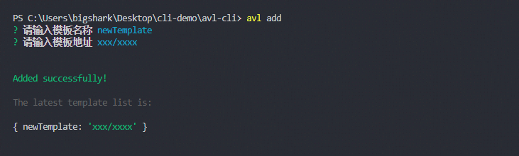
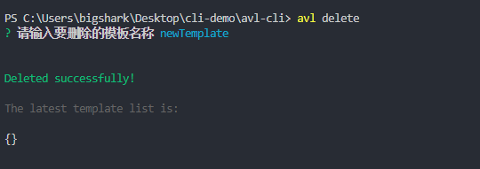

English | [简体中文](./README.md)

<p align="center"></p>

<h2 align="center">ave-cli（A simple front-end CLI tool）</h2>
<p align="center"><b>Generate personal front-end scaffolding based on Node construction（vue）</b></p>
# 目录

- [feature](#feature )
- [QuickStart](#QuickStart)
  - [Install](#Install)
  - [Usage](#Usage)
- [Contribution](#Contribution)
- [Maintainers](#Maintainers)
- [License](#license)

### feature

- Easy to use
- Support custom template addition and deletion

### QuickStart

### Install

```bash
$ npm i ave-cli -g               # install cli
$ omi init my-app     # init project, you can also exec 'omi init' in an empty folder
$ cd my-app           # please ignore this command if you executed 'omi init' in an empty folder
$ ave init [templateName] [yourProjectName]
```

Install description:

The default scaffolding template name is vue-admin
> ave init vue-admin [yourProjectName]

### New template usage

```bash
ave add
# Select template and template address (github address)
```




### Remove template usage

```bash
ave delete
# 选择模板
```




### See all template usage

```bash
ave list
```

### Initialize project scaffolding usage

```bash
ave init 或者 ave init [templateName] [yourProjectName]
```


## Contribution
- NorthernDream

## Maintainers

- [NorthernDream](https://github.com/NorthernDream)

## License

- [MIT](https://opensource.org/licenses/MIT)
